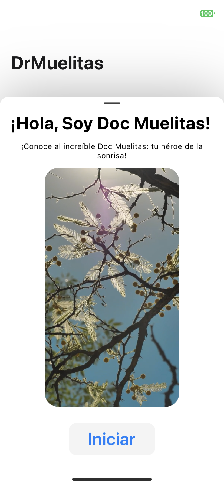
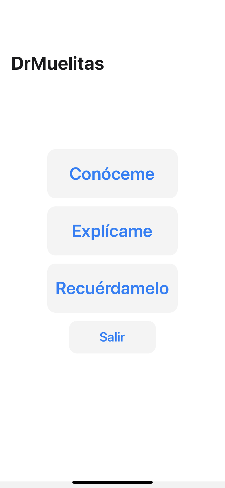
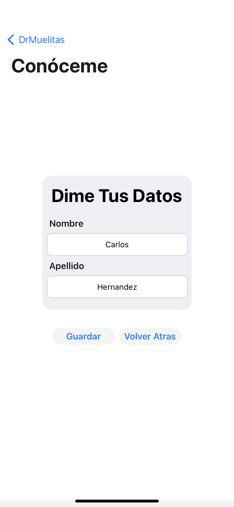
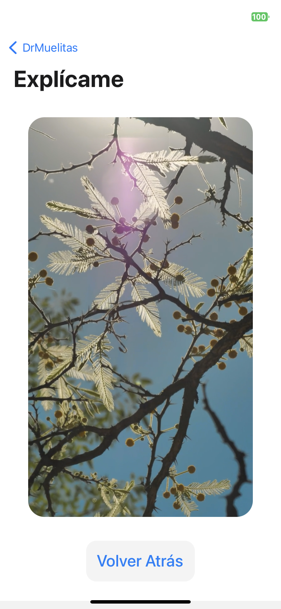
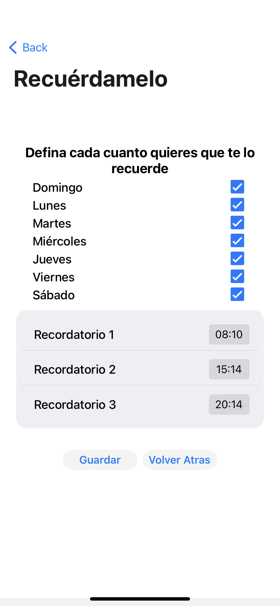

# DrMuelitas - W.I.P.

Cross-Platform Dental Care Mobile App designed with a primary focus on providing dental care information and a robust notification reminder system to a younger audience.

</img>
</img>

</img>
</img>
</img>

# TODO:

- [ ] Implement Proper Videos (in place of Placeholder ones)
- [ ] Implement Android Video Notification System
  - If enabled by the user, the app will automatically open and play a reminder video
- [ ] Fix Android GUI (or implement a new GUI)
- [ ] Multiple Language Support (through CrowdIn)
      r
